<div align="center">

## Demo Video

<a href="https://youtu.be/mENxPKIA7MM?si=ua1-EGOez0HX1J9f">
  
</a>
<br/>
<small>▶ Watch Demo</small>

</div>

---

Prism Motion serves all kinds of video needs for pharma companies — from explainer videos and drug mechanism animations to sales enablement and compliance content. It leverages Manim for programmatic scientific animations, Remotion for React-based video composition, Pexels + Pixabay APIs for stock footage, and SadTalker AI for photorealistic talking face generation. No editors, no agencies, no weeks of back-and-forth — just describe what you need and get a production-ready video.

---

## Setup

```bash
# Clone the repository
git clone https://github.com/Goyam02/Prism-Motion.git
cd prism-motion

# Backend setup
cd backend
python -m venv venv
source venv/bin/activate  # On Windows: venv\Scripts\activate
pip install -r requirements.txt

# Frontend setup
cd ../frontend
npm install
npm run dev

# Remotion setup
cd ../remotion
npm install
```

## Requirements

- Python 3.10+
- Node.js 18+
- FFmpeg
- OpenAI API key
- Pexels API key
- SadTalker (for avatar generation)

---

<table>
  <tr>
    <td align="center">
      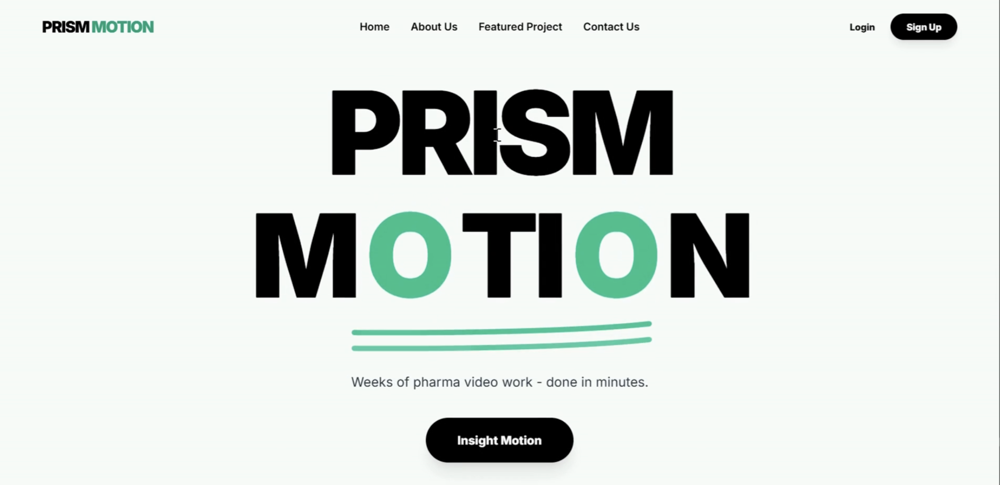
      <br/>
      <small>Landing Page Hero</small>
    </td>
  </tr>
</table>

<table>
  <tr>
    <td align="center">
      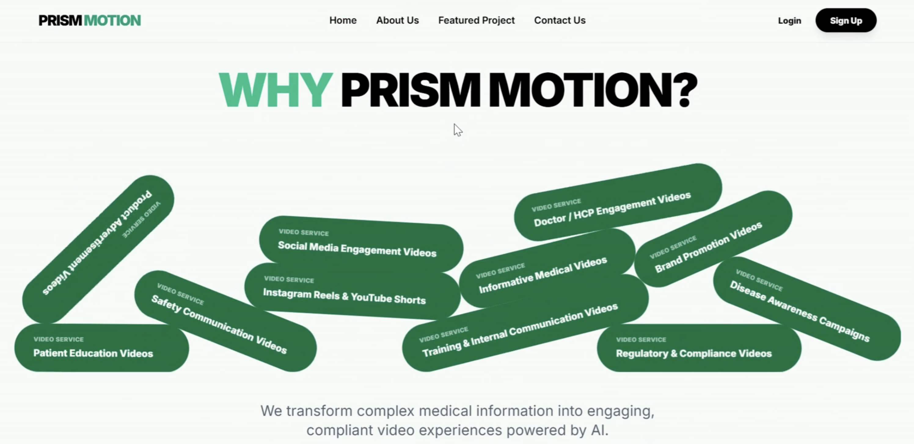
      <br/>
      <small>Landing Page — Why Prism Motion</small>
    </td>
  </tr>
</table>

<table>
  <tr>
    <td align="center">
      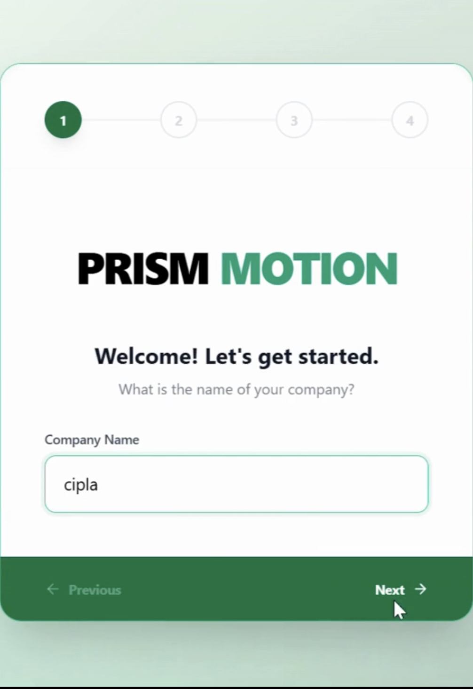
      <br/>
      <small>Signup — Step 1</small>
    </td>
    <td align="center">
      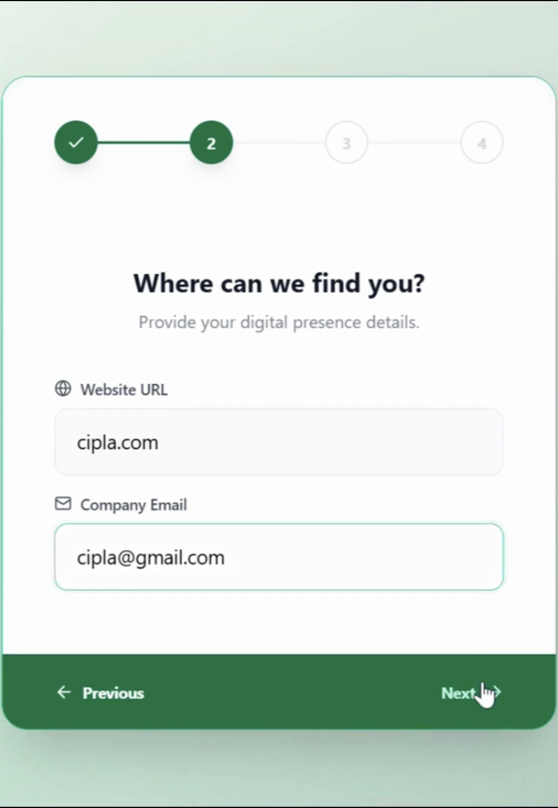
      <br/>
      <small>Signup — Step 2</small>
    </td>
    <td align="center">
      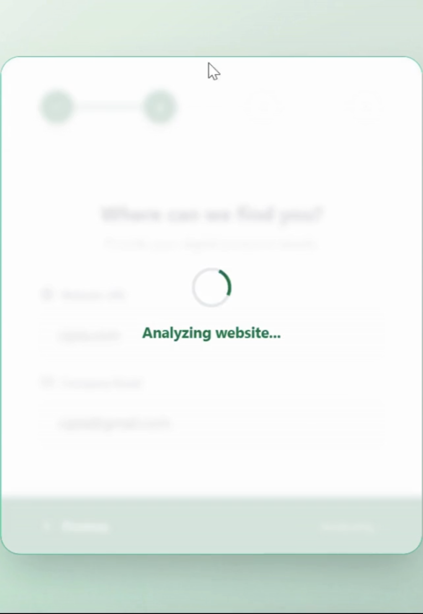
      <br/>
      <small>Signup — Step 3</small>
    </td>
    <td align="center">
      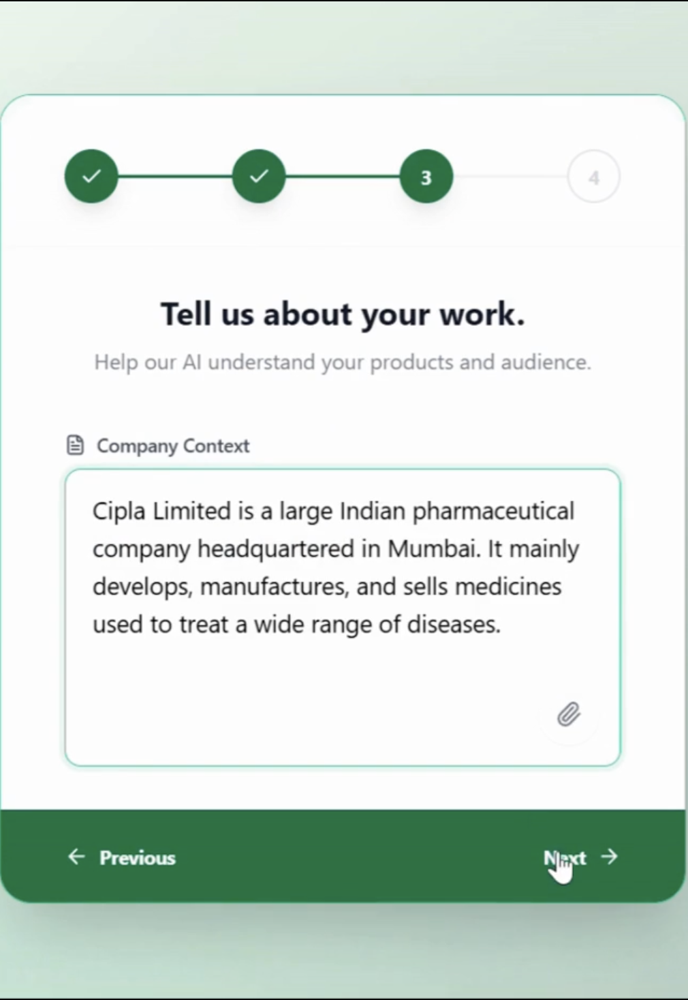
      <br/>
      <small>Signup — Step 4</small>
    </td>
    <td align="center">
      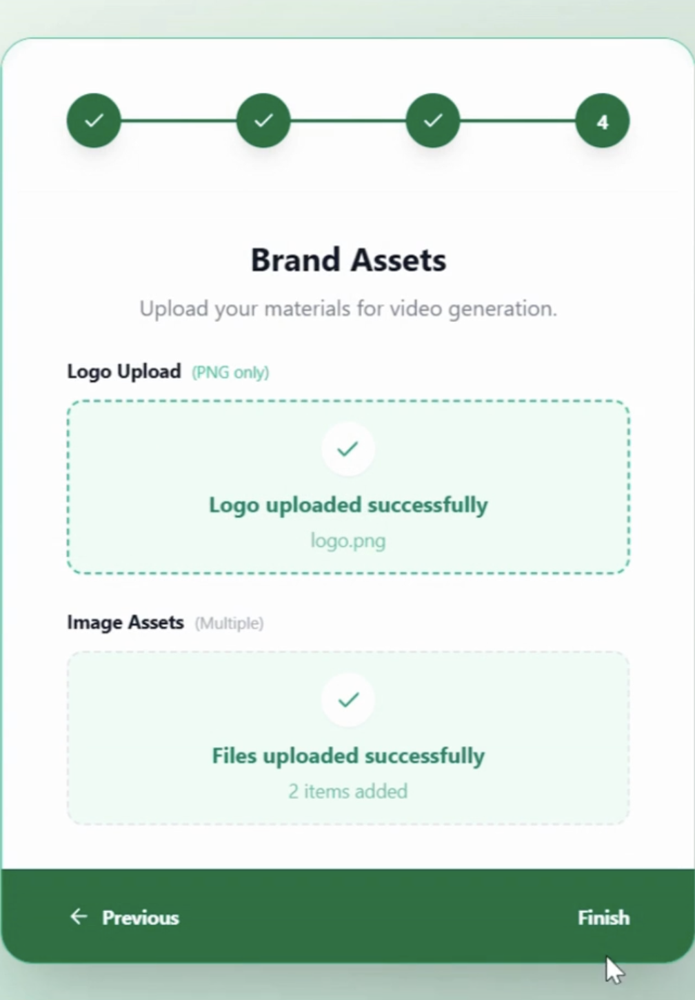
      <br/>
      <small>Signup — Step 5</small>
    </td>
  </tr>
</table>

<table>
  <tr>
    <td align="center">
      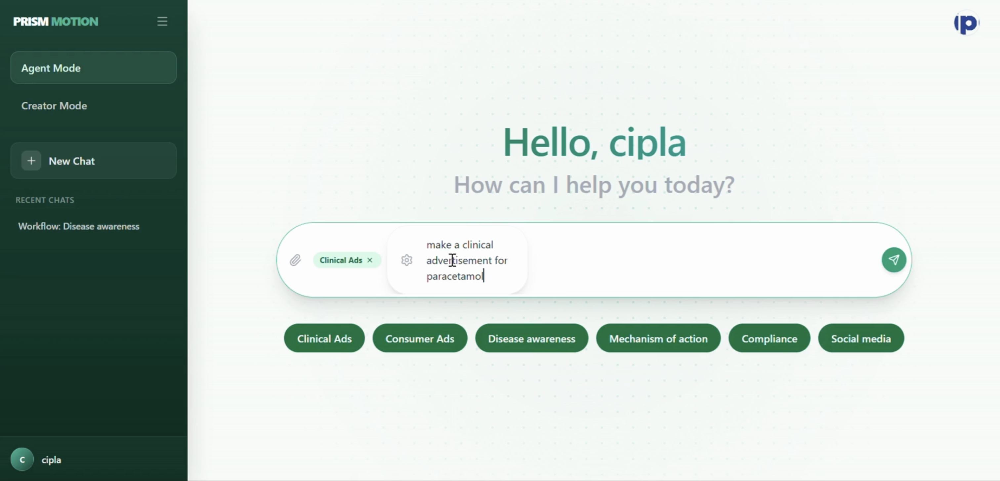
      <br/>
      <small>Agent Mode — Landing</small>
    </td>
  </tr>
</table>

<table>
  <tr>
    <td align="center">
      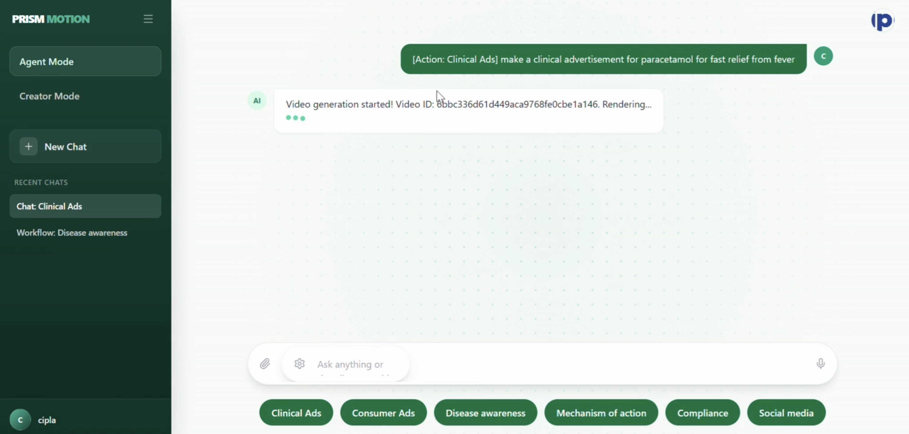
      <br/>
      <small>Agent Mode — Video Generation</small>
    </td>
  </tr>
</table>

<table>
  <tr>
    <td align="center">
      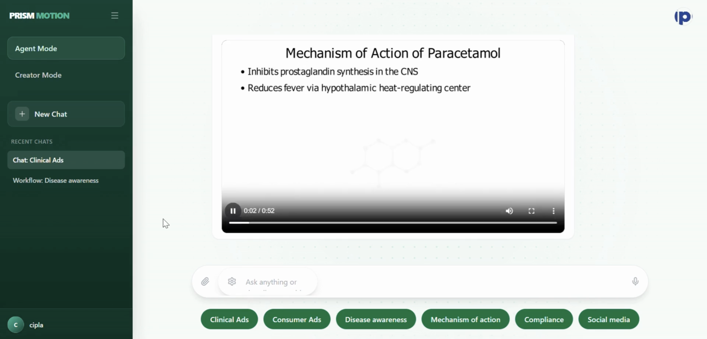
      <br/>
      <small>Agent Mode — Video Generated</small>
    </td>
  </tr>
</table>

<table>
  <tr>
    <td align="center">
      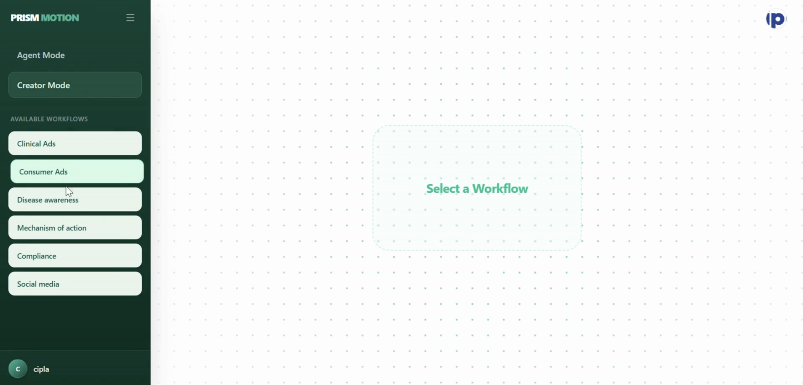
      <br/>
      <small>Creator Mode — Landing</small>
    </td>
  </tr>
</table>

<table>
  <tr>
    <td align="center">
      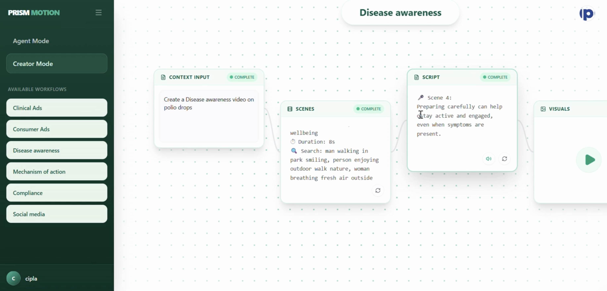
      <br/>
      <small>Creator Mode — Edit the Pipeline</small>
    </td>
  </tr>
</table>

<table>
  <tr>
    <td align="center">
      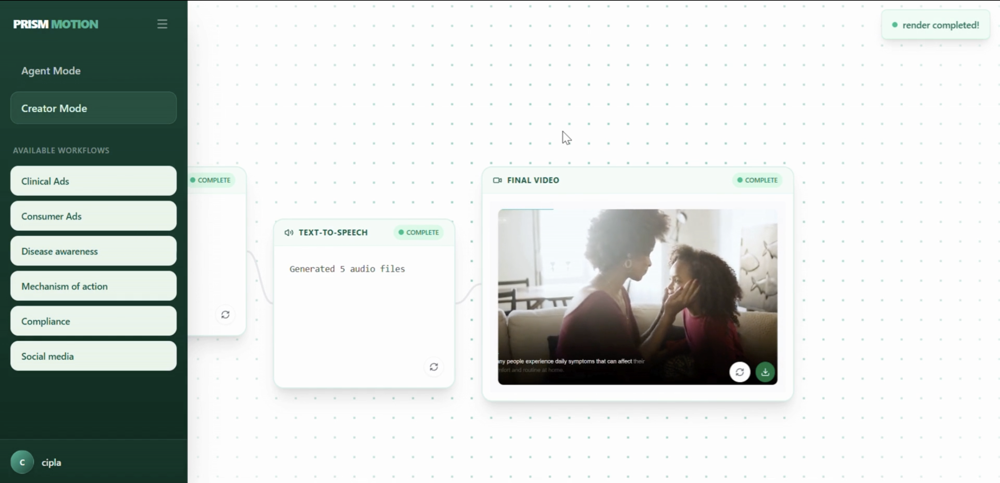
      <br/>
      <small>Creator Mode — Video Generated</small>
    </td>
  </tr>
</table>

---

## API Documentation

### Agent Mode

```bash
POST /api/v1/agent/video/generate
```
```json
{
  "prompt": "Explain how Metformin works for Type 2 diabetes patients",
  "target_audience": "patients",
  "video_length": "medium",
  "avatar_image": "https://example.com/doctor-portrait.jpg"
}
```
```json
{
  "job_id": "vid_abc123",
  "estimated_time": "4 minutes",
  "status": "queued"
}
```

```bash
GET /api/v1/agent/video/status/{job_id}
```
```json
{
  "job_id": "vid_abc123",
  "status": "processing",
  "progress": 67,
  "scenes": [
    { "name": "Introduction", "status": "complete" },
    { "name": "Mechanism of Action", "status": "rendering" },
    { "name": "Benefits", "status": "pending" }
  ]
}
```

```bash
GET /api/v1/agent/video/download/{job_id}
```
Returns the final rendered MP4 file.

### Creator Mode

```bash
POST /api/v1/creator/pipeline/create
```
```json
{
  "prompt": "Create a promotional video for our new hypertension medication"
}
```
```json
{
  "pipeline_id": "pipe_xyz789",
  "pipeline": {
    "scenes": [
      {
        "id": 1,
        "type": "stock",
        "pexels_query": "doctor checkup",
        "duration": 5
      },
      {
        "id": 2,
        "type": "animation",
        "manim_scene": "blood_flow",
        "duration": 8
      }
    ],
    "narration": ["Welcome to our new treatment..."],
    "suggestions": {
      "footage": ["medical office", "patient consultation"],
      "animations": ["cell mechanism", "drug absorption"]
    }
  }
}
```

```bash
PUT /api/v1/creator/pipeline/{pipeline_id}
```
```json
{
  "scenes": [
    {
      "id": 1,
      "type": "stock",
      "pexels_query": "hospital hallway",
      "duration": 5
    }
  ],
  "narration": ["Updated narration text here..."]
}
```
```json
{
  "pipeline_id": "pipe_xyz789",
  "status": "updated"
}
```

```bash
POST /api/v1/creator/pipeline/{pipeline_id}/render
```
```json
{
  "job_id": "vid_abc123",
  "status": "rendering"
}
```

### Shared

```bash
POST /api/v1/avatar/generate
```
```json
{
  "portrait_image": "https://example.com/doctor.jpg",
  "audio_file": "https://example.com/narration.mp3"
}
```
```json
{
  "job_id": "avatar_123",
  "video_url": "https://cdn.prismmotion.ai/avatars/avatar_123.mp4"
}
```

```bash
GET /api/v1/video/status/{job_id}
```
```json
{
  "job_id": "vid_abc123",
  "status": "complete",
  "progress": 100,
  "video_url": "https://cdn.prismmotion.ai/videos/vid_abc123.mp4"
}
```

```bash
WebSocket /ws/{session_id}
```
Real-time progress updates:
```json
{
  "type": "progress",
  "status": "processing",
  "scene": "Mechanism of Action",
  "percent": 45
}
```

---

<div align="center">

**Weeks of pharma video work done in minutes.**

</div>

---

## Features

### Two Modes for Every Workflow

**Agent Mode** — Fully automated video generation. Just describe what you need and let AI handle everything from script to final render. Perfect for quick turnarounds and high-volume production.

**Creator Mode** — Full creative control with AI assistance. Generate a pipeline, then tweak scenes, swap footage, adjust narration, and preview before rendering. Ideal for precision work and brand compliance.

### Video Types

| Type | Description | Use Case |
|------|-------------|----------|
| **Product Ads** | Marketing videos with stock footage | Social media, websites |
| **Mechanism of Action (MoA)** | Scientific animations explaining drug mechanisms | Medical education, HCPs |
| **Doctor Ads** | Promotional content for healthcare professionals | Sales enablement |
| **Social Media** | Short-form vertical videos | Instagram, TikTok, LinkedIn |
| **Compliance Videos** | Regulatory-compliant promotional content | FDA/EMA approved materials |

### Technology Stack

- **Manim** — Programmatic scientific animations for MoA videos
- **Remotion** — React-based video composition and rendering
- **Pexels + Pixabay APIs** — Stock photo and video footage
- **SadTalker AI** — Photorealistic talking face generation
- **ElevenLabs / OpenAI TTS** — Natural voice narration
- **FastAPI** — High-performance Python backend
- **React + TypeScript** — Modern frontend UI
- **WebSockets** — Real-time progress updates

---

## Environment Configuration

Create a `.env` file in the `backend` directory:

```bash
# OpenAI Configuration
OPENAI_API_KEY=sk-...

# Pexels API
PEXELS_API_KEY=...

# Pixabay API (optional)
PIXABAY_API_KEY=...

# SadTalker URL (if using remote instance)
SADTALKER_URL=http://localhost:8002

# Database
DATABASE_URL=sqlite:///./prism_motion.db

# Frontend URL (for CORS)
FRONTEND_URL=http://localhost:5173
```

---

## Running the Application

### Development

```bash
# Terminal 1: Start backend
cd backend
source venv/bin/activate
uvicorn app.main:app --reload

# Terminal 2: Start frontend
cd frontend
npm run dev

# Terminal 3: Start Remotion (for rendering)
cd remotion
npm run dev
```

The backend runs on `http://localhost:8000`, frontend on `http://localhost:5173`.

### Production Build

```bash
# Build frontend
cd frontend
npm run build

# Backend uses uvicorn with workers
cd backend
uvicorn app.main:app --workers 4
```

---

## Project Structure

```
prism-motion/
├── backend/
│   ├── app/
│   │   ├── main.py              # FastAPI application
│   │   ├── creator_mode.py      # WebSocket creator mode
│   │   ├── stages/             # Video generation pipeline
│   │   │   ├── stage1_scenes.py
│   │   │   ├── stage2_remotion.py
│   │   │   ├── stage3_script.py
│   │   │   ├── stage4_tts.py
│   │   │   └── stage5_render.py
│   │   ├── moa_stages/         # Manim MoA pipeline
│   │   ├── doctor_ad_stages/   # Doctor advertisement pipeline
│   │   ├── social_media/       # Social media pipeline
│   │   └── utils/              # LLM, Pexels, helpers
│   └── requirements.txt
├── frontend/
│   ├── src/
│   │   ├── components/         # React components
│   │   ├── App.tsx
│   │   └── index.tsx
│   ├── package.json
│   └── images/                 # UI screenshots
├── remotion/
│   ├── src/
│   │   ├── PharmaVideo.tsx    # Main video component
│   │   ├── ComplianceVideo.tsx
│   │   └── Root.tsx
│   └── package.json
└── README.md
```

---

## Advanced API Usage

### WebSocket Real-time Updates

Connect to receive live progress:

```javascript
const ws = new WebSocket('ws://localhost:8000/ws/creator');

ws.onmessage = (event) => {
  const data = JSON.parse(event.data);
  console.log(`${data.scene}: ${data.percent}%`);
};
```

### Region Support

Query supported regions for TTS and content:

```bash
GET /supported-regions
```

---

## Troubleshooting

**Video rendering fails**
- Check FFmpeg is installed: `ffmpeg -version`
- Verify sufficient disk space for temp files
- Check Remotion/Manim logs in backend output

**TTS not working**
- Verify OpenAI API key has credits
- Check ElevenLabs API key if using that provider

**Stock footage not found**
- Try different search queries
- Pixabay fallback will attempt alternative searches

**Avatar generation slow**
- SadTalker requires GPU for fast processing
- Consider using remote SadTalker instance

---

## License

Proprietary — All rights reserved.

---

<div align="center">

Built for pharma. Powered by AI.

</div>